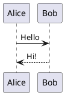

# markdown-to-docm

A CLI tool that appends rendered Markdown (with PlantUML diagrams) to an existing `.docx` or `.docm` Word document. The title page, header, footer, table of contents, and all existing content in the document are preserved.

## Installation

```bash
pip install -e .
```

## Usage

```bash
md2docm INPUT -d DOCUMENT -o OUTPUT [OPTIONS]
```

### Arguments and options

| Argument / Option | Short | Required | Description |
|---|---|---|---|
| `INPUT` | | Yes | Path to the input Markdown file |
| `--document PATH` | `-d` | Yes | Path to the `.docx`/`.docm` file to append content to |
| `--output PATH` | `-o` | Yes | Path for the output file |
| `--plantuml-server URL` | `-s` | No | Base URL of the PlantUML server (default: `http://www.plantuml.com/plantuml`) |

### Examples

Append using the default PlantUML server:
```bash
md2docm content.md -d my_document.docm -o output.docm
```

Append using a self-hosted PlantUML server:
```bash
md2docm content.md -d my_document.docm -o output.docm -s http://plantuml.my-company.local
```

## How it works

The tool opens the specified `.docx`/`.docm` file, inserts a page break after the existing content, then appends the rendered Markdown. The output is saved to the path specified by `--output`, leaving the original document untouched.

All existing content is preserved — title page, headers, footers, table of contents, styles, and macros.

## Supported Markdown features

### Headings

Headings map to the corresponding Word heading styles (`Heading 1` through `Heading 6`) as defined in the document.

```markdown
# Heading 1
## Heading 2
### Heading 3
```

### Inline formatting

```markdown
**bold**, *italic*, **_bold and italic_**, `inline code`
```

### Lists

Unordered and ordered lists, with up to 3 levels of nesting.

```markdown
- Item one
- Item two
  - Nested item
    - Double nested

1. First
2. Second
```

Uses Word styles `List Bullet` / `List Number` (and their `2` / `3` variants for nesting).

### Tables

```markdown
| Column A | Column B |
|----------|----------|
| Value 1  | Value 2  |
```

Rendered using the `Table Grid` Word style.

### Code blocks

Fenced code blocks (non-PlantUML) are rendered in `Courier New` 9pt:

````markdown
```python
def hello():
    print("Hello!")
```
````

### PlantUML diagrams

PlantUML fenced blocks are sent to the configured PlantUML server and inserted as PNG images (5 inches wide by default).

````markdown

````

If the server cannot be reached or returns an error, a placeholder error message is inserted in the document instead.

## Not currently supported

- Non-PlantUML images
- Hyperlinks
- Blockquotes (content is rendered but without special styling)
- Strikethrough
- Raw HTML (silently ignored)
