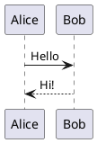

# markdown-to-docm

A CLI tool that converts Markdown files containing PlantUML diagrams to `.docm` (Word macro-enabled) documents, using a `.docm` template file to control styles and formatting.

## Installation

```bash
pip install -e .
```

## Usage

```bash
md2docm INPUT -t TEMPLATE -o OUTPUT [OPTIONS]
```

### Arguments and options

| Argument / Option | Short | Required | Description |
|---|---|---|---|
| `INPUT` | | Yes | Path to the input Markdown file |
| `--template PATH` | `-t` | Yes | Path to the `.docm` template file |
| `--output PATH` | `-o` | Yes | Path for the output `.docm` file |
| `--plantuml-server URL` | `-s` | No | Base URL of the PlantUML server (default: `http://www.plantuml.com/plantuml`) |

### Examples

Convert using the default PlantUML server:
```bash
md2docm document.md -t my_template.docm -o output.docm
```

Convert using a self-hosted PlantUML server:
```bash
md2docm document.md -t my_template.docm -o output.docm -s http://plantuml.my-company.local
```

## Supported Markdown features

### Headings

Headings map to the corresponding Word heading styles (`Heading 1` through `Heading 6`) defined in the template.

```markdown
# Heading 1
## Heading 2
### Heading 3
```

### Inline formatting

```markdown
**bold**, *italic*, **_bold and italic_**, `inline code`
```

### Lists

Unordered and ordered lists, with up to 3 levels of nesting.

```markdown
- Item one
- Item two
  - Nested item
    - Double nested

1. First
2. Second
```

Uses Word styles `List Bullet` / `List Number` (and their `2` / `3` variants for nesting).

### Tables

```markdown
| Column A | Column B |
|----------|----------|
| Value 1  | Value 2  |
```

Rendered using the `Table Grid` Word style.

### Code blocks

Fenced code blocks (non-PlantUML) are rendered in `Courier New` 9pt:

````markdown
```python
def hello():
    print("Hello!")
```
````

### PlantUML diagrams

PlantUML fenced blocks are sent to the configured PlantUML server and inserted as PNG images (5 inches wide by default).

````markdown

````

If the server cannot be reached or returns an error, a placeholder error message is inserted in the document instead.

## Templates

Any `.docm` file can be used as a template. When the conversion runs, all body content in the template is removed and replaced with the converted Markdown content. Page layout, margins, headers, footers, and all styles defined in the template are preserved.

Make sure your template defines the Word styles your document uses — the standard styles (`Heading 1`–`Heading 6`, `Normal`, `List Bullet`, `List Number`, `Table Grid`) are present in every Word document by default.

## Not currently supported

- Non-PlantUML images
- Hyperlinks
- Blockquotes (content is rendered but without special styling)
- Strikethrough
- Raw HTML (silently ignored)
